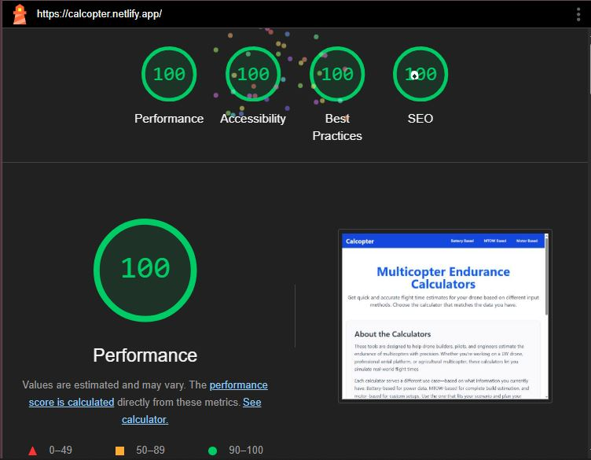

---

# Multicopter Endurance Calculator

A suite of online calculators designed to estimate the flight time of multicopters (drones) using different input methods. Choose from battery-based, MTOW-based, or motor-based calculations to plan your drone builds with precision.

## Table of Contents

- [Multicopter Endurance Calculator](#multicopter-endurance-calculator)
  - [Table of Contents](#table-of-contents)
  - [Overview](#overview)
  - [Features](#features)
  - [Tech Stack](#tech-stack)
  - [Installation](#installation)
  - [Usage](#usage)
  - [Image Optimization](#image-optimization)
  - [Lighthouse Report](#lighthouse-report)
  - [License](#license)
  - [Contact](#contact)

## Overview

The **Multicopter Endurance Calculators** project provides quick and accurate flight time estimates for drones. The calculators help drone builders, pilots, and engineers simulate real-world flight times based on:
- **Battery Specs:** Capacity, voltage, and average power consumption.
- **MTOW (Maximum Takeoff Weight):** Endurance estimates for complete builds.
- **Motor Specs:** Custom calculations when using non-standard motors.

## Features

- **User-friendly Interface:** Clean, responsive design with a modern UI built in React.
- **Multiple Calculation Methods:** Choose the method that fits your available data.
- **Optimized Images:** Responsive images in WebP format with multiple resolutions.
- **Accessible Design:** Focus on accessibility with proper alt texts, descriptive links.

## Tech Stack

- **React** – Frontend library
- **React Router** – Client-side routing
- **Tailwind CSS** – Utility-first CSS framework for rapid UI development
- **Lucide Icons** – Icon library for modern, customizable icons
- **Vite** (or Create React App/Next.js, depending on your setup) – Build tool

## Installation

Clone the repository:

```bash
git clone https://github.com/ashwin-dukare/calcopter.git
cd calcopter
```

Install dependencies:

```bash
npm install
```

Start the development server:

```bash
npm run dev
```

For Create React App:

```bash
npm start
```

## Usage

- Navigate to the homepage to see the list of calculators.
- Click on any calculator card to view its detailed page.
- Use the navigation bar to explore different sections of the application.
- The project is optimized for both desktop and mobile devices.

## Image Optimization

Images in the project are served in WebP format with different sizes using `srcSet` and `sizes` attributes in the `CalculatorCard` component. This helps to reduce bandwidth usage and improve load times across different devices.

## Lighthouse Report

Our project scores **100/100** on Lighthouse, ensuring excellent performance, accessibility, best practices, and SEO.




## License

This project is licensed under the [MIT License](LICENSE).

## Contact

For any questions or suggestions, please contact:
- **Your Name** – [ashwindukare6@gmail.com](mailto:ashwindukare6@gmail.com)
- GitHub: [@ashwin-dukare](https://github.com/ashwin-dukare)

---


